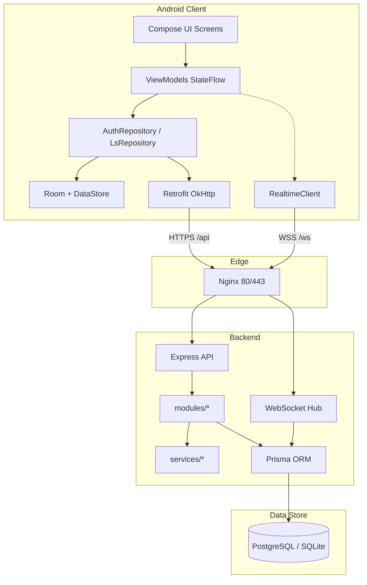
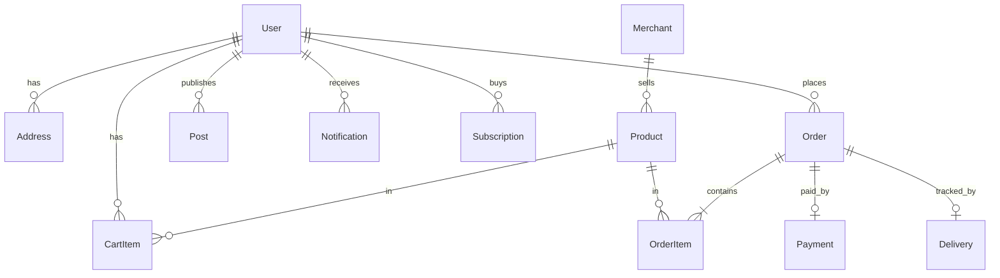
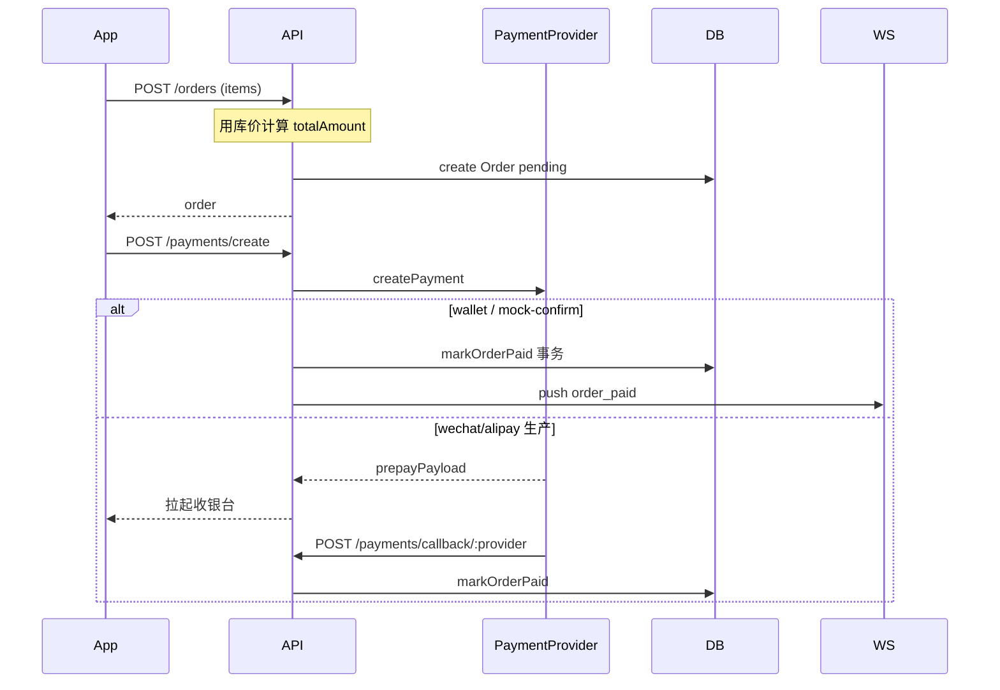

# 连山同城 LsLife · 开发者手册（二次开发指南）

> 版本：V1.0（商业化重构基线）  
> 更新日期：2026-07  
> 适用对象：后端 / Android / 全栈二次开发人员  

本文档覆盖仓库当前真实实现：原生 Android 客户端、Node.js 后端、生产部署与扩展约定。早期 React 网页原型（`src/`）仅作设计参考，**不再作为运行主体**。

---

## 目录

1. [项目总结](#1-项目总结)
2. [仓库地图](#2-仓库地图)
3. [总体架构](#3-总体架构)
4. [技术栈与语言](#4-技术栈与语言)
5. [数据模型](#5-数据模型)
6. [后端底层逻辑](#6-后端底层逻辑)
7. [通信协议](#7-通信协议)
8. [算法与业务规则](#8-算法与业务规则)
9. [Android 客户端架构](#9-android-客户端架构)
10. [环境、构建与部署](#10-环境构建与部署)
11. [二次开发指南](#11-二次开发指南)
12. [已知缺口与路线图](#12-已知缺口与路线图)
13. [附录](#13-附录)

---

## 1. 项目总结

### 1.1 产品定位

连山壮族瑶族自治县同城生活服务 App：周边商家/服务浏览、加购下单、模拟支付与配送追踪、同城信息发布（会员额度）、会员订阅、AI 推荐助手（可插拔）、用户设置（主题/通知）。

### 1.2 当前交付状态

| 维度 | 状态 |
|------|------|
| 后端 API | 可运行；健康检查、冒烟测试通过 |
| 生产部署 | 火山云 `115.191.6.95`，域名 `mentalhlp.site`，Nginx + HTTPS + PostgreSQL + PM2 |
| Android | Kotlin + Compose 完整主链路；Debug APK 可装机 |
| 支付 / 短信 / 地图 | Provider 抽象已就绪，生产默认 `mock` |
| 合规 | 见 [`docs/COMPLIANCE.md`](COMPLIANCE.md) |

### 1.3 生产入口

| 用途 | 地址 |
|------|------|
| REST API | `https://mentalhlp.site/api/` |
| WebSocket | `wss://mentalhlp.site/ws?token=<JWT>` |
| 健康检查 | `https://mentalhlp.site/api/health` |

### 1.4 已实现用户主链路

```
登录(短信验证码) → 首页浏览/搜索 → 商家详情加购
  → 服务端计价下单 → mock 支付 → 订单追踪(模拟配送)
  → 同城发布(额度校验) → 会员订阅 → 设置(主题/通知/清缓存)
```

---

## 2. 仓库地图

```
d:\LsLife\
├── android/                 # 原生 Android 客户端（商业化主体）
├── backend/                 # Node.js + Express + Prisma 后端
├── docs/
│   ├── COMPLIANCE.md        # 商业化合规清单
│   └── DEVELOPER_HANDBOOK.md # 本文档
├── src/                     # 早期 React 网页原型（参考）
├── releases/                # 本地构建 APK 交付副本
├── .github/workflows/ci.yml # 后端 smoke + Android assembleDebug
├── AGENTS.md                # 原型时代存档说明
└── README.md                # 仓库总览
```

### 2.1 后端关键路径

| 路径 | 说明 |
|------|------|
| `backend/src/index.ts` | HTTP + WebSocket 启动 |
| `backend/src/app.ts` | Express 中间件与路由挂载 |
| `backend/src/modules/*` | REST 业务模块 |
| `backend/src/services/*` | 短信/支付/AI/审核/配送/履约 |
| `backend/src/realtime/hub.ts` | WebSocket 推送 |
| `backend/prisma/schema.prisma` | 数据模型 |
| `backend/deploy/*` | 生产部署脚本 |

### 2.2 Android 关键路径

| 路径 | 说明 |
|------|------|
| `android/app/.../LsLifeApp.kt` | 导航壳 + 底栏 + FAB |
| `android/app/.../feature/*` | 业务页面 Screen + ViewModel |
| `android/app/.../core/network/*` | Retrofit / 鉴权 / WS |
| `android/app/.../core/data/*` | Repository + DataStore |
| `android/app/.../ui/theme/*` | 温暖本地生活设计系统 |
| `android/app/build.gradle.kts` | `API_BASE_URL` / `WS_BASE_URL` |

---

## 3. 总体架构



### 3.1 分层原则

| 层 | 规则 |
|----|------|
| 客户端 UI | 只读 `MaterialTheme` / 通用组件；不直连网络 |
| 客户端 ViewModel | 持有 `StateFlow`；调用 Repository；不解析 HTTP 细节 |
| 客户端 Repository | `safeCall` 解包；写缓存；暴露 `Result` |
| 后端 modules | Zod 校验 + 鉴权 + 编排；金额必须服务端计算 |
| 后端 services | 可插拔 Provider（mock / 云厂商）；副作用与外部系统 |

### 3.2 统一响应信封

所有 REST 成功/业务失败均使用：

```json
{
  "code": 0,
  "message": "ok",
  "data": { }
}
```

- `code === 0`：成功，`data` 为有效载荷  
- `code !== 0`：业务错误（HTTP 可能仍为 200 或 4xx，取决于错误中间件）  
- Android 侧由 `safeCall` 转为 `Result.failure(ApiException)`

实现：`backend/src/lib/http.ts`、`android/.../core/network/Safe.kt`。

---

## 4. 技术栈与语言

### 4.1 后端

| 能力 | 选型 |
|------|------|
| 语言 | TypeScript（ESM，` "type": "module"`） |
| 运行时 | Node.js ≥ 20 |
| HTTP | Express 4 + helmet + cors |
| ORM | Prisma 5 |
| 校验 | Zod |
| 鉴权 | jsonwebtoken（Bearer） |
| 实时 | `ws` |
| 进程 | PM2 + systemd |
| 反向代理 | Nginx + Let's Encrypt |
| DB | 开发 SQLite；生产 PostgreSQL 16 |

### 4.2 Android

| 能力 | 选型 |
|------|------|
| 语言 | Kotlin 2.0.21 |
| UI | Jetpack Compose + Material 3 |
| 架构 | MVVM + StateFlow |
| DI | Hilt + KSP |
| 网络 | Retrofit + OkHttp + kotlinx.serialization |
| 本地 | Room（商家缓存）+ DataStore（token/主题/通知） |
| 图片 | Coil |
| 导航 | Navigation Compose |
| 构建 | AGP 8.7.3 / Gradle 8.11.1 / JDK 17 |

### 4.3 原型（参考，非运行主体）

React + Tailwind + motion/react（`src/`），记录早期交互与视觉。

---

## 5. 数据模型

来源：`backend/prisma/schema.prisma`。



### 5.1 核心表说明

| 模型 | 关键字段 / 规则 |
|------|----------------|
| User | `membershipTier`: free/vip/premium；`realNameStatus`；`idCardHash`（仅哈希）；钱包/积分 |
| VerificationCode | 手机号验证码，5 分钟过期，`consumed` |
| Merchant / Product | `externalId` 兼容种子 `m1`/`m1_1`；`tags`/`images` 为 JSON 字符串 |
| CartItem | `@@unique([userId, productId])` |
| Order | 状态机见 §8；金额服务端写入 |
| Payment | channel: mock/wechat/alipay/wallet |
| Delivery | 骑手坐标、progress、status |
| Post | published / pending_review / rejected / removed |
| Subscription | 会员订购记录 |
| Notification | 履约等业务通知 |

本地开发默认 `provider = "sqlite"`；生产脚本可切换为 `postgresql`。

---

## 6. 后端底层逻辑

### 6.1 启动链路

```
index.ts
  → createApp()          # Express
  → http.createServer
  → attachRealtime(server)  # /ws
  → listen(PORT)
```

路由挂载见 `backend/src/app.ts`：`/api/auth`、`/merchants`、`/cart`、`/orders`、`/payments`、`/posts`、`/membership`、`/notifications`、`/addresses`、`/ai`。

### 6.2 鉴权

| 步骤 | 行为 |
|------|------|
| 发码 | `POST /auth/send-code`；60s 限频；入库 6 位码 |
| 登录 | `POST /auth/login`；校验未消费且未过期码；无用户则自动注册 |
| Token | JWT：`{ sub: userId, phone }`，默认 30 天 |
| 强制鉴权 | `requireAuth` 解析 `Authorization: Bearer` |
| 可选鉴权 | `optionalAuth`（如帖子列表 `mine=true`） |
| 实名 | 身份证 SHA-256 入库，响应剔除哈希 |

实现：`modules/auth.ts`、`middleware/auth.ts`、`lib/jwt.ts`、`services/sms.ts`。

### 6.3 订单与支付



`markOrderPaid`（`services/order-fulfillment.ts`）事务内：

1. 订单 → `paid`，记录 `paidAt`  
2. Payment → `success`  
3. 商品销量累加  
4. 创建 Delivery  
5. 清空该商家购物车  
6. 写入 Notification  
7. WebSocket `order_paid`

### 6.4 同城发布与审核

1. 校验本月额度（见 §8）  
2. `CONTENT_MODERATION_ENABLED`：本地敏感词表  
3. 命中 → `rejected`；否则 → `published`  
4. `rejected` **不计入**额度

### 6.5 会员

- `GET /membership/plans`：套餐列表  
- `POST /membership/subscribe`：**当前为演示直开**（不经支付），写入 Subscription 并更新用户 tier / until（+1 月）

### 6.6 Provider 插件

| 服务 | 环境变量 | 已实现 | Stub |
|------|----------|--------|------|
| 短信 | `SMS_PROVIDER` | mock | aliyun / tencent |
| 支付 | `PAY_PROVIDER` | mock | wechat / alipay |
| AI | `AI_PROVIDER` | mock；dashscope 可调通 | qianfan/doubao 仍指向兼容接口占位 |

扩展方式：在对应 `services/*.ts` 实现接口并在工厂函数中注册，**勿只改 env**。

---

## 7. 通信协议

### 7.1 REST

- Base URL（生产）：`https://mentalhlp.site/api/`  
- Content-Type：`application/json`  
- 鉴权头：`Authorization: Bearer <token>`  

#### API 一览

| Method | Path | 鉴权 |
|--------|------|------|
| GET | `/` 或 `/api/` | 公开（指引） |
| GET | `/health` | 公开 |
| POST | `/auth/send-code` | 公开 |
| POST | `/auth/login` | 公开 |
| GET | `/auth/me` | 强制 |
| POST | `/auth/realname` | 强制 |
| PATCH | `/auth/profile` | 强制 |
| GET | `/merchants` | 公开 |
| GET | `/merchants/recommended` | 公开 |
| GET | `/merchants/:id` | 公开 |
| GET/POST/DELETE | `/cart` | 强制 |
| POST/GET | `/orders` | 强制 |
| GET | `/orders/:id` | 强制 |
| POST | `/orders/:id/cancel` | 强制（仅 pending） |
| POST | `/payments/create` | 强制 |
| POST | `/payments/mock-confirm` | 强制 |
| POST | `/payments/callback/:provider` | 公开（第三方回调） |
| POST | `/posts` | 强制 |
| GET | `/posts` | 可选 |
| GET | `/posts/quota` | 强制 |
| GET | `/membership/plans` | 公开 |
| POST | `/membership/subscribe` | 强制 |
| GET | `/notifications` | 强制 |
| POST | `/notifications/read-all` | 强制 |
| POST | `/notifications/:id/read` | 强制 |
| DELETE | `/notifications` | 强制 |
| GET/POST | `/addresses` | 强制 |
| PUT/DELETE | `/addresses/:id` | 强制 |
| POST | `/ai/recommend` | 可选 |

### 7.2 WebSocket

| 项 | 说明 |
|----|------|
| URL | `wss://mentalhlp.site/ws?token=<JWT>` |
| 缺 token | close `4001` |
| 验签失败 | close `4003` |
| 连接成功 | `{"event":"connected","userId":"..."}` |
| 服务端推送 | `pushToUser(userId, payload)` |
| 已知事件 | `{ "event": "order_paid", "orderId", "orderNo" }` |
| 客户端上行 | 当前无业务协议（预留给骑手 GPS） |

Nginx 对 `/ws` 配置 `Upgrade` / `Connection`，读超时 3600s。

### 7.3 Android 网络装配

```
NetworkModule
  → OkHttp(AuthInterceptor + Logging)
  → Retrofit(baseUrl = BuildConfig.API_BASE_URL)
  → ApiService
```

`AuthInterceptor`：`TokenStore.current()` → `Bearer`。  
`RealtimeClient`：已封装，订单追踪页当前仍用 **HTTP 3 秒轮询**，可切换到 WS。

---

## 8. 算法与业务规则

### 8.1 订单金额（防篡改）

```
itemsTotal = Σ (库中商品单价 × 数量)
totalAmount = itemsTotal + merchant.deliveryFee
```

客户端提交的价格字段**不参与**计费；仅传 `productId` + `quantity`。

订单号：`LS` + 6 位数字（nanoid 字母表）。

### 8.2 订单状态机

```
pending ──支付成功──► paid
  │                     │
  │取消                 ▼
  ▼              preparing ──► delivering ──► delivered
cancelled
```

仅 `pending` 可取消。

### 8.3 配送进度模拟（演示算法）

文件：`backend/src/services/delivery.ts`

| 阶段 | 时长 | progress |
|------|------|----------|
| preparing | 支付后 0–20s | `elapsed/20 * 100` |
| delivering | 20–110s | `(elapsed-20)/90 * 100` |
| delivered | ≥110s | 100 |

骑手坐标线性插值：

```
lat = merchantLat + (userLat - merchantLat) * ratio
lng = merchantLng + (userLng - merchantLng) * ratio
```

用户演示坐标固定：`(24.472, 112.081)`。  
生产应改为骑手端上报 GPS，并扩展 WS 事件（如 `rider_location`）。

### 8.4 发布额度

| 会员档 | 每月可发（非 rejected） |
|--------|-------------------------|
| free | 3 |
| vip | 20 |
| premium | 50 |

按自然月统计；超额返回业务错误（客户端可引导开通会员）。

### 8.5 内容审核（当前）

本地敏感词表匹配；未接入云审。关闭开关：`CONTENT_MODERATION_ENABLED=false`。

### 8.6 首页搜索防抖（Android）

`HomeViewModel.onQueryChange`：更新 query 后 `delay(400)` 再请求，避免每键全量 Loading。

### 8.7 商家列表离线优先

`LsRepository.merchants`：成功 → Room upsert；失败且无筛选时 → 回退 `merchant_cache`。

---

## 9. Android 客户端架构

### 9.1 包分层

```
com.lianshan.lslife
├── LsLifeApplication / MainActivity
├── di/                 NetworkModule, DatabaseModule
├── core/
│   ├── model/          ApiEnvelope, 业务模型, ThemeMode
│   ├── network/        ApiService, Requests, AuthInterceptor, RealtimeClient, Safe
│   ├── data/           TokenStore, AuthRepository, LsRepository
│   └── database/       Room Entity/Dao
├── ui/
│   ├── LsLifeApp       导航壳
│   ├── SessionViewModel
│   ├── navigation/Routes
│   ├── theme/          Color Type Shape Dimens Theme
│   └── components/     通用 UI
└── feature/
    ├── auth / home / merchant / cart
    ├── orders / publish / profile / settings
```

### 9.2 导航与壳层

- 登录门控：`SessionViewModel.isLoggedIn`  
- 底栏：首页 | 订单 | **中央 FAB 发布** | 购物车 | 我的  
- 二级页（商家、追踪、设置等）隐藏底栏  
- 主题：`MainActivity` 订阅 `themeMode` → `LsLifeTheme(darkTheme=…)`

### 9.3 Feature 职责速查

| Feature | 职责 |
|---------|------|
| auth | 短信登录 |
| home | 分类 2×4、排序、搜索防抖、推荐横滑、商家卡 |
| merchant | 加购、服务端结算、mock 支付跳转追踪 |
| cart | 按商家分组展示、改数量 |
| orders | 列表筛选、状态胶囊 |
| order_track | 时间轴 + 进度模拟图（轮询） |
| publish | 分类、额度条、发帖 |
| profile | 资产、会员弹窗、入口菜单 |
| settings | 主题 / 通知 / 清缓存 / 关于 / 隐私 |

### 9.4 UI 设计系统

温暖本地生活风格：

- Primary：赤陶橙 `#C45C26`（深色提亮）  
- Background：暖米 / 暖炭  
- 组件：`BrandHero`、`WarmSearchField`、`MerchantListCard`、`StatusChip`、`PrimaryButton` 等  

全面屏：根 `Scaffold(contentWindowInsets = 0)`；Hero 渐变顶满，内层 `statusBarsPadding`。

### 9.5 偏好持久化（DataStore `ls_session`）

| Key | 用途 |
|-----|------|
| `token` | JWT（登出清除） |
| `theme_mode` | system/light/dark（登出保留） |
| `notifications_enabled` | 通知偏好（登出保留） |

---

## 10. 环境、构建与部署

### 10.1 后端本地

```bash
cd backend
cp .env.example .env   # DATABASE_URL=file:./dev.db
npm install
npx prisma generate
npx prisma db push
npm run seed
npm run dev            # :4000
npm run smoke          # 端到端冒烟
```

### 10.2 后端生产（摘要）

1. `deploy/setup-production.sh`（需 sudo）：Nginx、Certbot、PostgreSQL、UFW、PM2 自启  
2. `deploy/migrate-to-postgres.sh`：切 PG、建表、种子、构建、PM2  
3. 域名 A 记录 → 服务器；安全组放行 80/443  
4. 常用：`pm2 status` / `pm2 logs lslife-api` / `sudo systemctl status nginx postgresql`

### 10.3 Android 构建

```bash
cd android
# JDK 17+，ANDROID_HOME 已配置
./gradlew.bat assembleDebug
# 产物：app/build/outputs/apk/debug/app-debug.apk
```

`build.gradle.kts`：

```kotlin
API_BASE_URL = "https://mentalhlp.site/api/"
WS_BASE_URL  = "wss://mentalhlp.site/ws"
```

模拟器连本机后端可临时改为 `10.0.2.2:4000`。  
**正式上架需配置 release `signingConfigs`**（当前仅 debug 签名）。

### 10.4 关键环境变量

| 变量 | 说明 |
|------|------|
| `PORT` | 默认 4000 |
| `DATABASE_URL` | SQLite 或 PostgreSQL 连接串 |
| `JWT_SECRET` | 生产必须强随机 |
| `SMS_PROVIDER` / `PAY_PROVIDER` / `AI_PROVIDER` | mock 或云厂商 |
| `AI_API_KEY` / `AI_MODEL` | 大模型 |
| `CONTENT_MODERATION_ENABLED` | 内容审核开关 |

完整模板：`backend/.env.example`。

---

## 11. 二次开发指南

### 11.1 新增 REST 接口（后端）

1. 在 `prisma/schema.prisma` 增模型（如需）→ `prisma db push` 或 migrate  
2. 新建或扩展 `src/modules/xxx.ts`（Zod + `asyncHandler`）  
3. 在 `app.ts` 挂载 `app.use('/api/xxx', router)`  
4. 复杂逻辑下沉 `services/`  
5. 更新 `scripts/smoke.ts` 覆盖关键路径  

### 11.2 新增页面（Android）

1. `Routes.kt` 增加常量  
2. `feature/xxx/` 新建 Screen + ViewModel  
3. `LsLifeApp` 注册 `composable`；按需隐藏底栏  
4. `ApiService` + `Models`/`Requests` + Repository 方法  

### 11.3 切换真实支付 / 短信

1. 实现 `services/payment.ts` / `sms.ts` 中对应 Provider  
2. 配置 `.env` 商户号、密钥、回调 URL  
3. 回调必须**验签**后再 `markOrderPaid`  
4. 会员订阅改为走支付成功回调，禁止直开  

### 11.4 接入真实配送与地图

1. 骑手端上报：`WS` 消息 `{ event: "rider_location", orderId, lat, lng }`  
2. 服务端更新 `Delivery` 并 `pushToUser`  
3. Android `OrderTrackViewModel` 改订 `RealtimeClient.events()`  
4. UI 换高德/百度 SDK（Key + SHA1，见合规文档）  

### 11.5 数据库迁移纪律

- 开发可用 `db push`  
- 生产建议引入 `prisma migrate`，避免 `--accept-data-loss`  
- 切换 SQLite ↔ PostgreSQL 时注意类型差异与种子幂等（当前 seed 的 `update: {}` **不会刷新**已有字段）  

### 11.6 代码风格约定

- 金额、额度、库存：**只信服务端**  
- 不在业务 Screen 硬编码品牌色，用 `MaterialTheme.colorScheme`  
- 新全局状态优先 `App`/`SessionViewModel`，过大再引入专门 Store  
- 提交前：`npm run smoke` + `./gradlew assembleDebug`  

---

## 12. 已知缺口与路线图

| 优先级 | 项 | 说明 |
|--------|----|------|
| P0 | 正式支付验签与对账 | 当前 mock；会员直开 |
| P0 | release 签名与关闭明文流量 | 上架必备 |
| P1 | 云内容安全 + 人审队列 | 仅有本地词表 |
| P1 | 真实短信 | mock 回填验证码 |
| P1 | 订单追踪接 WebSocket | 客户端已有 RealtimeClient |
| P1 | 地址管理 / 实名 UI | API 已有 |
| P2 | AI 助手界面 | API `POST /ai/recommend` 已有 |
| P2 | 地图 SDK | 现为 Canvas 示意 |
| P2 | Redis / OSS | compose 有规划，代码未接 |
| P3 | Gradle 多模块拆分 | 现为单 `:app` |

合规清单持续跟踪：[`docs/COMPLIANCE.md`](COMPLIANCE.md)。

---

## 13. 附录

### 13.1 冒烟测试覆盖（`npm run smoke`）

健康检查 → 登录 → 实名 → 商家 → 购物车 → 地址 → 下单计价 → mock 支付 → 追踪 → 购物车清空 → 通知 → 发布额度 → 会员提升额度 → AI 推荐。

### 13.2 常用运维命令

```bash
# 服务器
pm2 status
pm2 logs lslife-api
pm2 restart lslife-api
sudo nginx -t && sudo systemctl reload nginx
sudo systemctl status postgresql

# 本地后端
cd backend && npm run build && npm start

# Android
cd android && ./gradlew.bat assembleDebug
adb install -r app/build/outputs/apk/debug/app-debug.apk
```

### 13.3 相关文档

| 文档 | 内容 |
|------|------|
| [`README.md`](../README.md) | 仓库总览 |
| [`backend/README.md`](../backend/README.md) | 后端快速开始 |
| [`BACKEND_DEVELOPER_GUIDE.md`](BACKEND_DEVELOPER_GUIDE.md) | 后端开发详细手册 |
| [`android/README.md`](../android/README.md) | Android 构建说明 |
| [`docs/COMPLIANCE.md`](COMPLIANCE.md) | 上架与合规 |
| [`AGENTS.md`](../AGENTS.md) | 原型模块存档 |

### 13.4 术语表

| 术语 | 含义 |
|------|------|
| Provider | 短信/支付/AI 的可替换实现 |
| Envelope | `{ code, message, data }` 统一响应 |
| Offline-first | 网络失败时回退本地缓存 |
| markOrderPaid | 支付成功后的履约事务 |
| FAB | 底栏中央发布悬浮按钮 |

---

**维护建议**：接口或模型变更时，同步更新本文档的「API 一览」「数据模型」「算法与业务规则」三节，并补一条冒烟断言。
