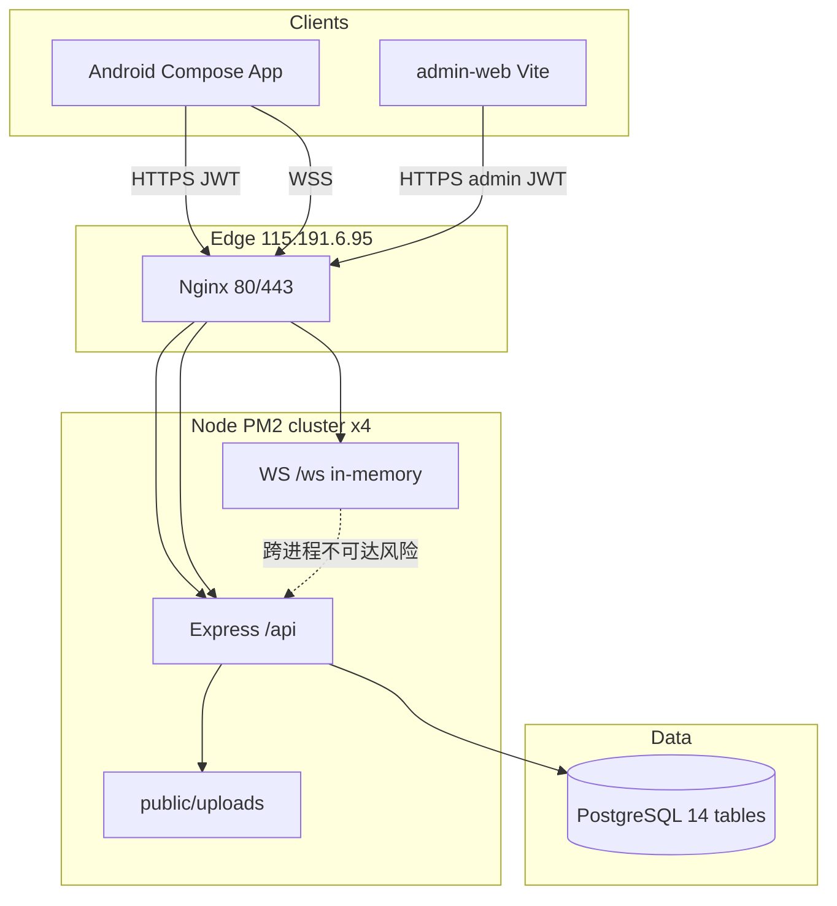

# LsLife 全面技术分析报告（Antigravity 升级后）

> 分析日期：2026-07-20  
> 组织方式：Android 客户端组 · 后端 API 组 · 运维/DB 组 · 安全审计组 · 管理后台组  
> 运行态证据：SSH `lslife@115.191.6.95` + PostgreSQL 直查 + 公网 HTTPS 探针  

---

## 0. 执行摘要

Antigravity 二次开发把系统从「C 端同城 App + mock 后端」推进到「**C 端 App + 管理后台 + 上传/AI 文案 + 内容/KYC 审核骨架**」。生产服务**健康在线**（PM2 4 实例 cluster、Nginx HTTPS、PostgreSQL 14 张表）。

同时发现 **P0 安全缺陷**：`/api/admin/*` 仅检查 `Authorization: Bearer` 是否存在，**未校验 `isAdmin`**。已用普通用户短信登录拿到的 JWT 成功读取 `/api/admin/dashboard`（返回业务数据）。

| 维度 | 结论 |
|------|------|
| 生产可用性 | ✅ `https://mentalhlp.site/api/health` 正常 |
| 数据库 | ✅ PostgreSQL，14 表；AdminUser 已落地 |
| Android | ✅ 主链路完整；新增实名/地址/消息/上传/AI 文案 |
| 管理后台 | ✅ `admin-web` 已部署在 `/admin-web/` |
| 安全 | ✅ 已热修 `requireAdminAuth`；用户 JWT 访问 admin 返回 403；JWT 已轮换；admin 密码已重置 |
| 文档 | ⚠️ `BACKEND_DEVELOPER_GUIDE.md` 未覆盖 admin/upload/新 Post 字段 |

---

## 1. 团队分工与本次结论

### 1.1 Android 软件开发组

**架构**：MVVM + Hilt + Compose + Retrofit + Room + DataStore，单模块 `:app`。

**Feature 地图**

| 包 | 能力 |
|----|------|
| `feature/auth` | 短信登录 |
| `feature/home` | 分类、搜索、商家列表 |
| `feature/merchant` | 详情、加购、下单支付 |
| `feature/cart` / `orders` | 购物车、订单列表、追踪 |
| `feature/publish` | 闲鱼风发布、额度、**图片上传**、**AI 生成描述** |
| `feature/profile` | 个人中心 + **个人信息 / 地址 / 消息 / 实名**（升级新增） |
| `feature/settings` | 主题、通知、关于、隐私 |

**网络契约升级点**（`ApiService.kt`）

- 原有：auth / merchants / cart / orders / payments / addresses / posts / membership / notifications / ai.recommend  
- **新增**：`POST ai/generate-description`、`POST upload`（multipart）

**追踪页**：`OrderTrackViewModel` 已注入 `RealtimeClient`，监听 `rider_location` / `order_delivered`；首次仍 HTTP 拉单。生产配送仍多为服务端时间模拟，真实 GPS 推送未形成闭环。

**构建**：`compileSdk 36` / `minSdk 24` / `targetSdk 34`；debug/release 均指向生产域名；release 仍用 debug 签名且开启 minify。

**缺口**

- AI 助手独立 UI 仍弱（仅发布页文案生成）  
- 地图 SDK 未接  
- 压力测试有 `MockDataStressTest`，缺真机联调 CI 门禁  

### 1.2 后端 API 组

**相对旧手册的新增**

| 模块 | 路径 | 说明 |
|------|------|------|
| `modules/admin.ts` | `/api/admin/*` | 登录、大盘、帖子审核、KYC、用户余额/会员 |
| `modules/upload.ts` | `/api/upload` | multer 本地盘 `public/uploads`，单张/批量 |
| `modules/ai.ts` | `generate-description` | 闲鱼风文案 |
| Prisma `AdminUser` | — | 后台账号 |
| Post 字段 | `brand` / `condition` / `shipping` | 闲置扩展 |
| schema provider | **postgresql**（本地仓库已切） | 与生产一致 |

**支付**：`PAY_PROVIDER=mock`（生产 env）；`wechatProvider` 仍为**模拟 prepay/假验签**，不可当真。

**实名逻辑冲突（功能债）**

- App/API：`POST /auth/realname` → 直接 `realNameStatus = verified`  
- Admin：`/admin/kyc` 期望 `pending` 再人工审核  
→ 管理端 KYC 队列与 C 端实名**未闭环**

**静态资源**：`express.static('public/uploads')` + helmet CORP 放宽；Nginx 需保证 `/uploads` 可达（当前根路径 `/uploads/` 404，需确认单文件 URL 是否经 Node 反代）。

### 1.3 管理后台组（admin-web）

- Vite + React Router，`basename=/admin-web`  
- 页面：Login、Dashboard、UserManagement、ContentAudit、KycAudit  
- Orders / Settings：**占位「建设中」**  
- Axios base：`https://mentalhlp.site/api/admin`  
- 生产已可打开：`https://mentalhlp.site/admin-web/`  

### 1.4 运维 / 数据库组（SSH 实测）

| 项 | 实测值 |
|----|--------|
| 主机 | `iv-yeckqap0cgcva4hay1hj`，Ubuntu，kernel 6.8 |
| 运行用户 | `lslife`（免密 SSH OK） |
| 应用目录 | `/home/lslife/lslife-backend` |
| Node | v20.19.5（用户空间） |
| 进程 | PM2 `lslife-api` **4 instances / cluster**，uptime ~16h，重启计数 10 |
| 监听 | `:4000` 全网；Postgres `127.0.0.1:5432`；Nginx 80/443 |
| 健康 | 本机与公网 HTTPS 均 `status:up` |
| Provider | SMS/PAY/AI = **mock**；审核开关 true |

**表行数（2026-07-20）**

| 表 | 行数 |
|----|------|
| User | 5（探针登录后会增加） |
| Merchant | 7 |
| Product | 14 |
| Order | 2 |
| Post | 2 |
| Payment | 2 |
| AdminUser | 1 |

**Cluster 风险**：`realtime/hub.ts` 用进程内 `Map` 存 WS 连接。`instances: max` 时，`pushToUser` **可能打到错误 worker**，订单支付推送不可靠。建议：单实例，或 Redis pub/sub / sticky session。

### 1.5 安全审计组（P0）

1. **管理 API 伪鉴权（已复现）**  
   任意用户 JWT → `GET /api/admin/dashboard` 成功（code=0，含 newUsers/revenue 等）。  
   同理可影响 posts 审核、改余额、改会员等写接口。  
   **修复**：实现 `requireAdminAuth`，校验 JWT `isAdmin===true`（并校验 AdminUser 存在）；禁止用户 token 复用。

2. **密钥进库**  
   - `backend/deploy.mjs` 含 **root 明文密码**  
   - `remote.env` 含生产 DB/JWT  
   → 应立刻轮换密码/密钥，移出 Git，改用密钥登录 + secrets 管理。

3. **管理员与用户共用 JWT_SECRET**  
   可行，但必须用 claim 区分并强制校验；当前缺校验。

4. **余额接口**  
   `PUT /admin/users/:id/balance` 可任意增减，无审计日志。

5. **上传**  
   仅校验 mimetype 前缀，落本地盘；缺病毒扫描、OSS、鉴权后的 CDN 防盗。

---

## 2. 系统架构（升级后）

---

## 3. 升级变更对照（相对 V1 商业化基线）

| 能力 | V1 基线 | Antigravity 后 |
|------|---------|----------------|
| DB provider（仓库） | sqlite 文档为主 | **postgresql** |
| 管理后台 | 无 | admin-web + AdminUser + /api/admin |
| 图片上传 | 无 / 外链 | multer 本地上传 |
| 发布字段 | 基础 title/desc | + brand/condition/shipping |
| AI | 仅 recommend | + generate-description |
| Android 个人中心 | 入口弱 | 实名/地址/消息/个人信息页 |
| 订单追踪 | HTTP 轮询 | RealtimeClient 事件订阅（服务端推送仍弱） |
| 支付 | mock | 仍 mock；wechat 假实现 |
| PM2 | 单进程倾向 | **cluster max** |

---

## 4. 端到端主链路健康度

| 链路 | 状态 | 说明 |
|------|------|------|
| 登录 | ✅ | mock 短信回传 code |
| 商家浏览 | ✅ | 7 商家在线 |
| 下单/支付 | ⚠️ 演示 | mock-confirm；非真实资金 |
| 配送追踪 | ⚠️ | 时间模拟 + 客户端等 WS；cluster 下推送不稳 |
| 发布+上传 | ⚠️ | 代码齐；uploads 对外路径需再验 |
| 会员 | ⚠️ | 仍可直开 |
| 实名 vs KYC | ❌ | C 端直接 verified，后台 pending 脱节 |
| 管理审核 | ❌ 安全 | 功能有，鉴权无效 |

---

## 5. 优先修复清单（给研发排期）

### P0（立刻）

1. 实现并挂载 `requireAdminAuth`；回归测试：用户 token 必须 403  
2. 轮换服务器 root 密码、JWT_SECRET、PG 密码；从仓库删除 `deploy.mjs` 明文与 `remote.env` 机密  
3. PM2 改为 `instances: 1` 或引入 Redis 适配 WS  

### P1

4. 实名改为 `pending`，对接 KYC 审核通过才 `verified`  
5. 支付回调真实验签；关闭生产 `mock-confirm`  
6. Nginx 明确 `/uploads/` → Node 或静态目录  
7. 管理端订单/资金模块补齐；写操作审计日志  

### P2

8. OSS 替换本地上传；内容安全云审  
9. 更新 `docs/BACKEND_DEVELOPER_GUIDE.md` / 全栈手册  
10. Android release 正式签名；debug/prod 环境分 flavor  

---

## 6. 证据索引

- SSH：`lslife@115.191.6.95` LOGIN_OK  
- 健康：`https://mentalhlp.site/api/health` → code 0  
- 管理端：`https://mentalhlp.site/admin-web/` → 200 HTML  
- DB：`\dt` 14 表；AdminUser=1  
- 安全复现：用户 JWT → `/api/admin/dashboard` code 0  

---

## 7. 相关路径

| 路径 | 说明 |
|------|------|
| `android/app/src/main/java/com/lianshan/lslife/` | C 端 |
| `backend/src/modules/admin.ts` | 管理 API（需加固） |
| `backend/src/modules/upload.ts` | 上传 |
| `admin-web/` | 运营后台 |
| `/home/lslife/lslife-backend` | 生产代码目录 |
| `docs/BACKEND_DEVELOPER_GUIDE.md` | 需同步升级内容 |
